# Smarty Edu Platform - 全部接口与业务流程文档

> 自动生成，共 **13 个微服务模块**、**135+ 个 API 端点**、**10 个 MQ 消息处理器**

---

## 目录

1. [系统架构总览](#1-系统架构总览)
2. [se-auth 认证授权服务](#2-se-auth-认证授权服务)
3. [se-user 用户服务](#3-se-user-用户服务)
4. [se-course 课程服务](#4-se-course-课程服务)
5. [se-trade 交易服务](#5-se-trade-交易服务)
6. [se-pay 支付服务](#6-se-pay-支付服务)
7. [se-learning 学习服务](#7-se-learning-学习服务)
8. [se-search 搜索服务](#8-se-search-搜索服务)
9. [se-exam 考试服务](#9-se-exam-考试服务)
10. [se-media 媒资服务](#10-se-media-媒资服务)
11. [se-message 消息服务](#11-se-message-消息服务)
12. [se-promotion 营销服务](#12-se-promotion-营销服务)
13. [se-remark 互动服务](#13-se-remark-互动服务)
14. [se-data 数据看板](#14-se-data-数据看板)
15. [MQ 消息流转总览](#15-mq-消息流转总览)
16. [核心业务流程图](#16-核心业务流程图)

---

## 1. 系统架构总览

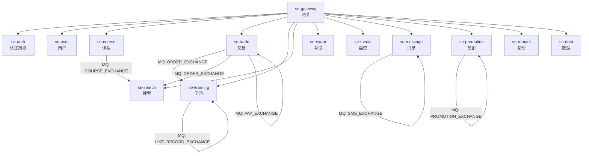

---

## 2. se-auth 认证授权服务

### 2.1 AccountController (`/accounts`)

| 方法 | 路径 | 说明 | 参数 |
|------|------|------|------|
| POST | `/accounts/login` | 学员登录获取token | `@RequestBody LoginFormDTO` |
| POST | `/accounts/admin/login` | 管理端登录获取token | `@RequestBody LoginFormDTO` |
| POST | `/accounts/logout` | 退出登录 | 无 |
| GET | `/accounts/refresh` | 刷新token | `@CookieValue("REFRESH_HEADER")` |

### 2.2 RoleController (`/roles`)

| 方法 | 路径 | 说明 | 参数 |
|------|------|------|------|
| GET | `/roles/list` | 查询所有角色列表 | 无 |
| GET | `/roles` | 查询自定义员工角色列表 | 无 |
| GET | `/roles/{id}` | 根据id查询角色 | `@PathVariable("id")` |
| POST | `/roles` | 新增角色 | `@RequestBody RoleDTO` |
| PUT | `/roles/{id}` | 修改角色信息 | `@PathVariable("id") + @RequestBody RoleDTO` |
| DELETE | `/roles/{id}` | 删除角色 | `@PathVariable("id")` |

### 2.3 PrivilegeController (`/privileges`)

| 方法 | 路径 | 说明 | 参数 |
|------|------|------|------|
| GET | `/privileges` | 分页查询所有权限 | `PageQuery` |
| GET | `/privileges/options/{menuId}` | 查询菜单下的权限选项 | `@PathVariable("menuId")` |
| GET | `/privileges/roles/{roleId}/{menuId}` | 查询某角色在某菜单下的权限 | `roleId + menuId` |
| POST | `/privileges` | 新增权限 | `@RequestBody PrivilegeDTO` |
| PUT | `/privileges/{id}` | 修改权限 | `id + PrivilegeDTO` |
| DELETE | `/privileges/{id}` | 删除权限 | `@PathVariable("id")` |
| POST | `/privileges/role/{roleId}` | 绑定角色与API权限 | `roleId + List<Long> privilegeIds` |
| DELETE | `/privileges/role/{roleId}` | 解除角色的API权限 | `roleId + List<Long> privilegeIds` |

### 2.4 MenuController (`/menus`)

| 方法 | 路径 | 说明 | 参数 |
|------|------|------|------|
| GET | `/menus/parent/{pid}` | 根据父菜单id查询子菜单 | `@PathVariable("pid")` |
| GET | `/menus/{id}` | 根据id查询菜单 | `@PathVariable("id")` |
| GET | `/menus` | 查询所有菜单（树结构） | 无 |
| GET | `/menus/me` | 查询当前用户菜单（树结构） | 无 |
| POST | `/menus` | 新增菜单 | `@RequestBody MenuDTO` |
| PUT | `/menus/{id}` | 更新菜单 | `id + MenuDTO` |
| DELETE | `/menus/{id}` | 删除菜单 | `@PathVariable("id")` |
| POST | `/menus/role/{roleId}` | 绑定角色与菜单权限 | `roleId + List<Long> menuIds` |
| DELETE | `/menus/role/{roleId}` | 解除角色的菜单权限 | `roleId + List<Long> menuIds` |

### 2.5 JwkController (`/jwks`)

| 方法 | 路径 | 说明 |
|------|------|------|
| GET | `/jwks` | 获取JWK公钥（Base64编码） |

### 认证授权流程

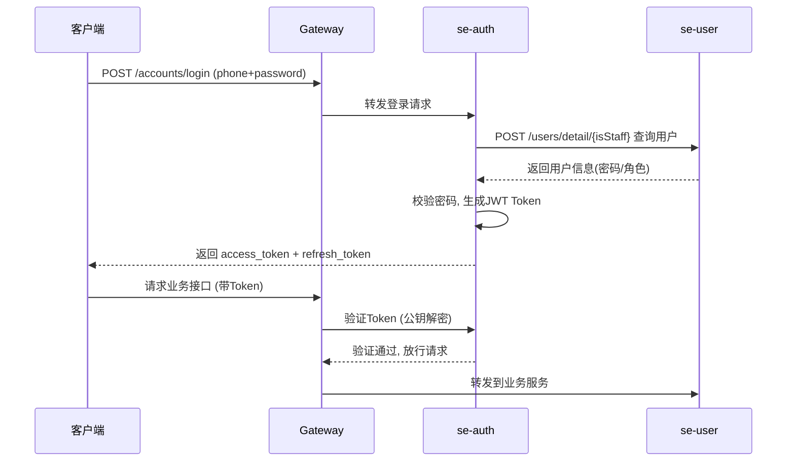

---

## 3. se-user 用户服务

### 3.1 UserController (`/users`)

| 方法 | 路径 | 说明 | 参数 |
|------|------|------|------|
| POST | `/users` | 新增用户（员工或教师） | `@RequestBody UserDTO` |
| PUT | `/users/{id}` | 更新用户信息 | `id + UserDTO` |
| PUT | `/users` | 更新当前用户信息 | `@RequestBody UserFormDTO` |
| PUT | `/users/{id}/password/default` | 重置密码 | `@PathVariable("id")` |
| PUT | `/users/{id}/status/{status}` | 修改用户状态(0禁用/1正常) | `userId + status` |
| GET | `/users/me` | 获取当前登录用户信息 | 无 |
| GET | `/users/{id}` | 根据id查询用户信息 | `@PathVariable("id")` |
| POST | `/users/detail/{isStaff}` | 根据登录信息查询用户详情(内部) | `LoginFormDTO + isStaff` |
| GET | `/users/list` | 根据id批量查询用户(内部) | `@RequestParam("ids")` |
| GET | `/users/{id}/type` | 查询用户类型(0学员/1老师/2员工) | `@PathVariable("id")` |
| GET | `/users/ids` | 根据手机号查询用户id | `@RequestParam("phone")` |
| GET | `/users/checkCellphone` | 检查手机号是否存在 | `@RequestParam("cellphone")` |

### 3.2 StudentController (`/students`)

| 方法 | 路径 | 说明 | 参数 |
|------|------|------|------|
| GET | `/students/page` | 分页查询学生信息 | `UserPageQuery` |
| POST | `/students/register` | 学员注册 | `@RequestBody StudentFormDTO` |
| PUT | `/students/password` | 修改学员密码 | `@RequestBody StudentFormDTO` |

### 3.3 TeacherController (`/teachers`)

| 方法 | 路径 | 说明 |
|------|------|------|
| GET | `/teachers/page` | 分页查询教师信息 |

### 3.4 StaffController (`/staffs`)

| 方法 | 路径 | 说明 |
|------|------|------|
| GET | `/staffs/page` | 分页查询员工信息 |

### 用户注册流程

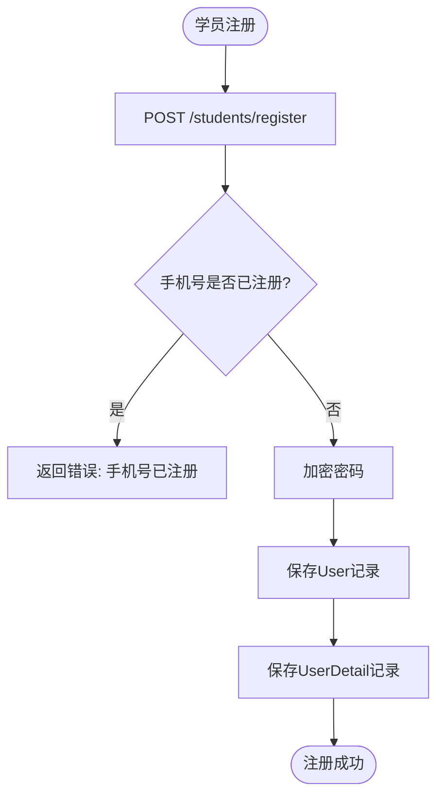

---

## 4. se-course 课程服务

### 4.1 CourseController (`/courses`) — 管理端

| 方法 | 路径 | 说明 | 参数 |
|------|------|------|------|
| GET | `/courses/baseInfo/{id}` | 获取课程基础信息 | `id + see` |
| POST | `/courses/baseInfo/save` | 保存课程基本信息 | `@RequestBody CourseBaseInfoSaveDTO` |
| GET | `/courses/catas/{id}` | 获取课程章节列表 | `id + see + withPractice` |
| POST | `/courses/catas/save/{id}/{step}` | 保存章节 | `List<CataSaveDTO> + id + step` |
| POST | `/courses/media/save/{id}` | 保存课程视频信息 | `id + List<CourseMediaDTO>` |
| POST | `/courses/subjects/save/{id}` | 保存小节/练习中的题目 | `id + List<CataSubjectDTO>` |
| GET | `/courses/subjects/get/{id}` | 获取小节/练习中的题目 | `id` |
| GET | `/courses/teachers/{id}` | 查询课程相关老师 | `id + see` |
| POST | `/courses/teachers/save` | 保存老师信息 | `@RequestBody CourseTeacherSaveDTO` |
| POST | `/courses/upShelf` | 课程上架 | `@RequestBody CourseIdDTO` |
| GET | `/courses/checkBeforeUpShelf/{id}` | 课程上架前校验 | `id` |
| POST | `/courses/downShelf` | 课程下架 | `@RequestBody CourseIdDTO` |
| DELETE | `/courses/delete/{id}` | 删除课程 | `id` |
| GET | `/courses/simpleInfo/list` | 查询课程简要信息列表 | `CourseSimpleInfoListDTO` |
| GET | `/courses/catas/index/list/{id}` | 查询课程所有章节序号 | `id` |
| GET | `/courses/generator` | 生成练习id | 无 |
| GET | `/courses/page` | 管理端课程分页搜索 | `CoursePageQuery` |
| GET | `/courses/checkName` | 校验课程名称是否已存在 | `id + name` |
| GET | `/courses/{id}/catalogs` | 查询课程目录和学习进度 | `courseId` |

### 4.2 CourseInfoController (`/course`) — 内部接口

| 方法 | 路径 | 说明 | 参数 |
|------|------|------|------|
| GET | `/course/infoByTeacherIds` | 通过老师id获取课程和出题数量 | `teacherIds` |
| GET | `/course/section/{id}` | 根据小节id获取mediaId和课程id | `sectionId` |
| GET | `/course/media/useInfo` | 根据媒资id查询被引用次数 | `mediaIds` |
| GET | `/course/{id}/searchInfo` | 课程上架时查询课程信息加入索引库 | `id` |
| GET | `/course/{id}` | 获取课程完整信息(含目录/老师) | `id + withCatalogue + withTeachers` |
| GET | `/course/getCateNameMap` | 根据三级分类id查询分类名称 | `thirdCateIdList` |
| GET | `/course/name` | 根据课程名称查询课程id列表 | `name` |

### 4.3 CategoryController (`/categorys`)

| 方法 | 路径 | 说明 | 参数 |
|------|------|------|------|
| GET | `/categorys/list` | 查询课程分类列表 | `CategoryListDTO` |
| GET | `/categorys/{id}` | 获取课程分类信息 | `id` |
| POST | `/categorys/add` | 新增课程分类 | `@RequestBody CategoryAddDTO` |
| DELETE | `/categorys/{id}` | 删除分类 | `id` |
| PUT | `/categorys/disableOrEnable` | 课程分类停用/启用 | `CategoryDisableOrEnableDTO` |
| PUT | `/categorys/update` | 更新课程分类 | `CategoryUpdateDTO` |
| GET | `/categorys/all` | 获取所有课程分类 | `admin` |
| GET | `/categorys/getAllOfOneLevel` | 获取所有课程分类(扁平) | 无 |

### 4.4 CatalogueController (`/catalogues`)

| 方法 | 路径 | 说明 | 参数 |
|------|------|------|------|
| GET | `/catalogues/batchQuery` | 根据id批量查询章节目录 | `ids` |
| GET | `/catalogues/querySectionInfoById/{id}` | 获取小节信息 | `id` |

### 课程管理流程

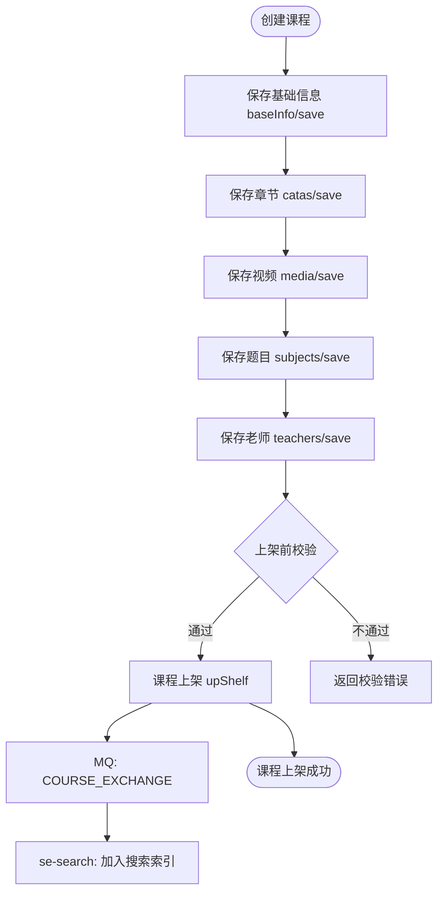

---

## 5. se-trade 交易服务

### 5.1 CartController (`/carts`)

| 方法 | 路径 | 说明 | 参数 |
|------|------|------|------|
| POST | `/carts` | 添加课程到购物车 | `@RequestBody CartsAddDTO` |
| GET | `/carts` | 获取购物车中的课程 | 无 |
| DELETE | `/carts/{id}` | 删除购物车条目 | `id` |
| DELETE | `/carts` | 批量删除购物车条目 | `ids` |

### 5.2 OrderController (`/orders`)

| 方法 | 路径 | 说明 | 参数 |
|------|------|------|------|
| GET | `/orders/page` | 分页查询我的订单 | `OrderPageQuery` |
| GET | `/orders/{id}` | 查询订单详细信息 | `id` |
| GET | `/orders/{id}/status` | 查询订单支付状态 | `orderId` |
| GET | `/orders/prePlaceOrder` | 预下单(确认优惠券) | `courseIds` |
| POST | `/orders/placeOrder` | 下单 | `@RequestBody PlaceOrderDTO` |
| POST | `/orders/freeCourse/{courseId}` | 免费课立刻报名 | `courseId` |
| PUT | `/orders/{id}/cancel` | 取消订单 | `orderId` |
| DELETE | `/orders/{id}` | 删除订单 | `id` |

### 5.3 OrderDetailController (`/order-details`)

| 方法 | 路径 | 说明 | 参数 |
|------|------|------|------|
| GET | `/order-details/page` | 分页查询订单明细 | `OrderDetailPageQuery` |
| GET | `/order-details/{id}` | 获取订单明细详情 | `id` |
| GET | `/order-details/course/{id}` | 校验课程是否已购买 | `courseId` |
| GET | `/order-details/enrollNum` | 统计课程报名人数 | `courseIdList` |
| GET | `/order-details/enrollCourse` | 统计学生报名课程数量 | `studentIds` |
| GET | `/order-details/purchaseInfo` | 获取课程购买信息 | `courseId` |

### 5.4 PayController (`/pay`)

| 方法 | 路径 | 说明 | 参数 |
|------|------|------|------|
| POST | `/pay/order` | 支付申请(返回二维码url) | `@RequestBody PayApplyFormDTO` |
| GET | `/pay/channels` | 获取支付渠道列表 | 无 |

### 5.5 RefundApplyController (`/refund-apply`)

| 方法 | 路径 | 说明 | 参数 |
|------|------|------|------|
| POST | `/refund-apply` | 退款申请 | `@RequestBody RefundFormDTO` |
| PUT | `/refund-apply/approval` | 审批退款申请 | `@RequestBody ApproveFormDTO` |
| PUT | `/refund-apply/cancel` | 取消退款申请 | `@RequestBody RefundCancelDTO` |
| GET | `/refund-apply/page` | 分页查询退款申请 | `RefundApplyPageQuery` |
| GET | `/refund-apply/{id}` | 查询退款详情 | `id` |
| GET | `/refund-apply/detail/{id}` | 根据子订单id查询退款详情 | `detailId` |
| GET | `/refund-apply/next` | 查询下一个待审批的退款申请 | 无 |

### 购买下单流程

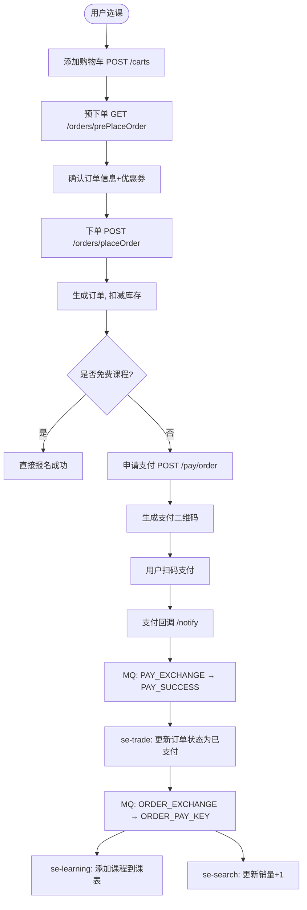

---

## 6. se-pay 支付服务

### 6.1 PayOrderController (`/pay-orders`)

| 方法 | 路径 | 说明 | 参数 |
|------|------|------|------|
| POST | `/pay-orders` | 扫码支付申请 | `@RequestBody PayApplyDTO` |
| GET | `/pay-orders/{bizOrderId}/status` | 查询支付结果 | `bizOrderId` |

### 6.2 PayChannelController (`/pay-channels`)

| 方法 | 路径 | 说明 | 参数 |
|------|------|------|------|
| GET | `/pay-channels/list` | 查询支付渠道列表 | 无 |
| POST | `/pay-channels` | 添加支付渠道 | `@RequestBody PayChannelDTO` |
| PUT | `/pay-channels/{id}` | 修改支付渠道 | `id + PayChannelDTO` |

### 6.3 RefundOrderController (`/refund-orders`)

| 方法 | 路径 | 说明 | 参数 |
|------|------|------|------|
| POST | `/refund-orders` | 申请退款 | `@RequestBody RefundApplyDTO` |
| GET | `/refund-orders/{bizRefundOrderId}/status` | 查询退款结果 | `bizRefundOrderId` |

### 6.4 NotifyController (`/notify`)

| 方法 | 路径 | 说明 | 参数 |
|------|------|------|------|
| POST | `/notify/{ALI_CHANNEL_CODE}` | 支付宝支付回调 | `HttpServletRequest` |
| POST | `/notify/{WX_CHANNEL_CODE}` | 微信支付回调 | `HttpEntity<String>` |
| POST | `/notify/refund/{WX_CHANNEL_CODE}` | 微信退款回调 | `HttpEntity<String>` |

### 支付流程

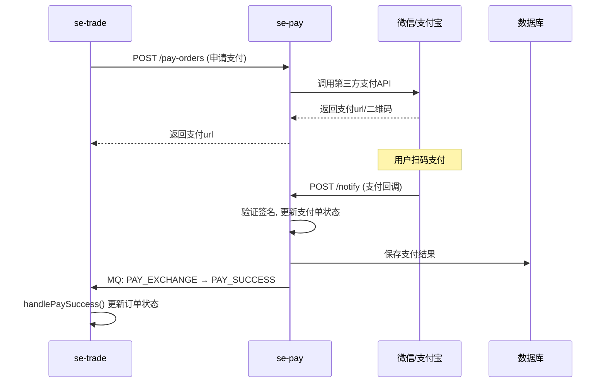

---

## 7. se-learning 学习服务

### 7.1 LearningLessonController (`/lessons`)

| 方法 | 路径 | 说明 | 参数 |
|------|------|------|------|
| GET | `/lessons/page` | 分页查询我的课表 | `PageQuery` |
| GET | `/lessons/now` | 查询正在学习的课程 | 无 |
| GET | `/lessons/{courseId}/valid` | 校验是否可以学习当前课程 | `courseId` |
| DELETE | `/lessons/{courseId}` | 删除课程 | `courseId` |
| GET | `/lessons/{courseId}` | 查询课程学习进度 | `courseId` |
| GET | `/lessons/lessons/{courseId}/count` | 查询课程报名人数 | `courseId` |
| POST | `/lessons/plans` | 创建学习计划 | `@RequestBody LearningPlanDTO` |
| GET | `/lessons/plans` | 查询我的学习计划 | `PageQuery` |

### 7.2 LearningRecordController (`/learning-records`)

| 方法 | 路径 | 说明 | 参数 |
|------|------|------|------|
| GET | `/learning-records/course/{courseId}` | 查询指定课程的学习记录 | `courseId` |
| POST | `/learning-records` | 提交学习记录 | `@RequestBody LearningRecordFormDTO` |

### 7.3 SignRecordController (`/sign-records`)

| 方法 | 路径 | 说明 |
|------|------|------|
| POST | `/sign-records` | 签到 |
| GET | `/sign-records` | 查询签到记录 |

### 7.4 PointsBoardController (`/boards`)

| 方法 | 路径 | 说明 |
|------|------|------|
| GET | `/boards/seasons/list` | 查询赛季信息列表 |
| GET | `/boards` | 查询赛季积分榜 |

### 7.5 PointsRecordController (`/points`)

| 方法 | 路径 | 说明 |
|------|------|------|
| GET | `/points/today` | 查询我的今日积分 |

### 7.6 LikedRecordController (`/likes`)

| 方法 | 路径 | 说明 | 参数 |
|------|------|------|------|
| POST | `/likes` | 点赞或取消赞 | `@RequestBody LikeRecordFormDTO` |

### 7.7 InteractionQuestionController (`/questions`)

| 方法 | 路径 | 说明 | 参数 |
|------|------|------|------|
| POST | `/questions` | 新增提问 | `@RequestBody QuestionFormDTO` |
| PUT | `/questions/{id}` | 修改提问 | `id + QuestionFormDTO` |
| DELETE | `/questions/{id}` | 删除提问 | `id` |
| GET | `/questions/page` | 分页查询问题(用户端) | `QuestionPageQuery` |
| GET | `/questions/{id}` | 查询问题详情(用户端) | `id` |

### 7.8 InteractionQuestionAdminController (`/admin`)

| 方法 | 路径 | 说明 | 参数 |
|------|------|------|------|
| GET | `/admin/questions/page` | 分页查询问题(管理端) | `QuestionAdminPageQuery` |
| PUT | `/admin/questions/{id}/hidden/{hidden}` | 隐藏或显示问题 | `id + hidden` |
| GET | `/admin/questions/{id}` | 查询问题详情(管理端) | `id` |
| GET | `/admin/replies/page` | 分页查询回答和评论(管理端) | `ReplyPageQuery` |
| PUT | `/admin/replies/{id}/hidden/{hidden}` | 隐藏或显示回答 | `id + hidden` |
| GET | `/admin/replies/{id}` | 查询回答详情(管理端) | `id` |

### 7.9 InteractionReplyController (`/replies`)

| 方法 | 路径 | 说明 | 参数 |
|------|------|------|------|
| POST | `/replies` | 新增回答或评论 | `@RequestBody ReplyDTO` |
| GET | `/replies/page` | 分页查询回答和评论(用户端) | `ReplyPageQuery` |

### 添加课程到课表流程

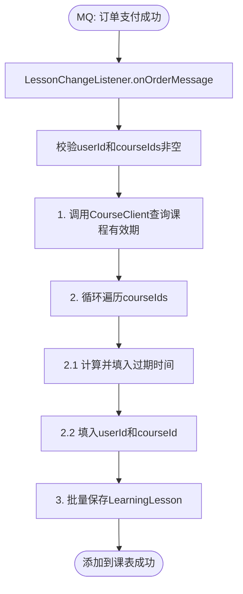

### 学习记录提交流程

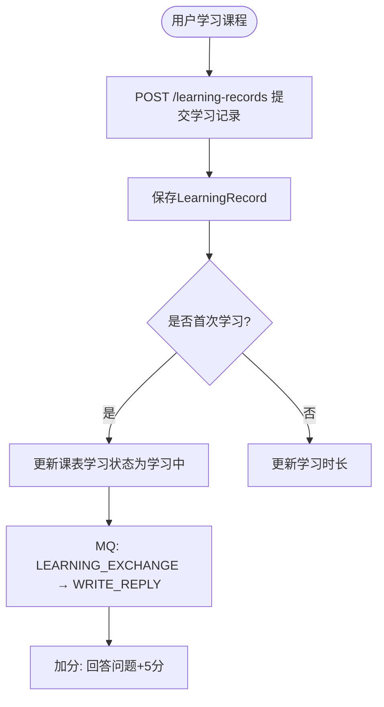

---

## 8. se-search 搜索服务

### 8.1 CourseController (`/courses`)

| 方法 | 路径 | 说明 | 参数 |
|------|------|------|------|
| GET | `/courses/portal` | 用户端课程搜索 | `CoursePageQuery` |
| GET | `/courses/name` | 根据关键字查询课程ID | `keyword` |
| POST | `/courses/up` | 处理课程上架(加入索引) | `courseIds` |
| POST | `/courses/down` | 处理课程下架(移除索引) | `courseIds` |

### 8.2 InterestsController (`/interests`)

| 方法 | 路径 | 说明 | 参数 |
|------|------|------|------|
| POST | `/interests` | 新增兴趣爱好 | `interestedIds` |
| GET | `/interests` | 查询我的兴趣爱好 | 无 |
| GET | `/interests/{id}/courses` | 根据二级分类id查询TOP10课程 | `cateLv2Id` |

### 8.3 RecommendController (`/recommend`)

| 方法 | 路径 | 说明 |
|------|------|------|
| GET | `/recommend/best` | 精品好课 |
| GET | `/recommend/new` | 新课推荐 |
| GET | `/recommend/free` | 精品公开课 |

### 课程搜索流程

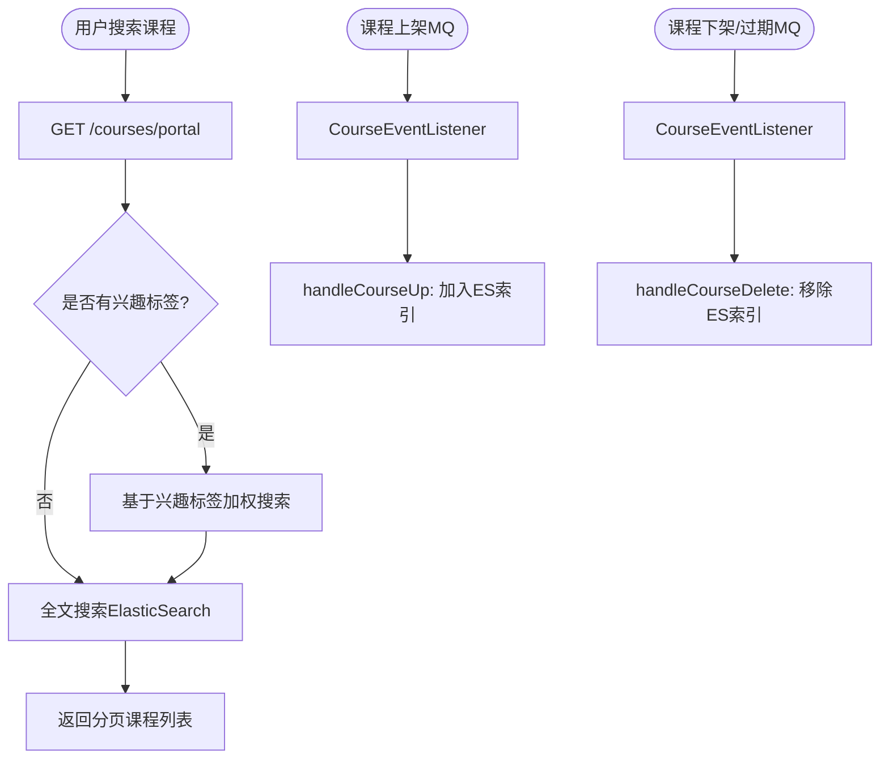

---

## 9. se-exam 考试服务

### 9.1 QuestionController (`/questions`)

| 方法 | 路径 | 说明 | 参数 |
|------|------|------|------|
| POST | `/questions` | 新增题目 | `@RequestBody QuestionFormDTO` |
| PUT | `/questions/{id}` | 修改题目 | `id + QuestionFormDTO` |
| DELETE | `/questions/{id}` | 删除题目 | `id` |
| GET | `/questions/page` | 分页查询题目 | `QuestionPageQuery` |
| GET | `/questions/{id}` | 查询题目详情 | `id` |
| GET | `/questions/list` | 查询题目列表 | `ids` |
| GET | `/questions/scores` | 查询题目分值 | `ids` |
| GET | `/questions/numOfTeacher` | 查询老师出题数量 | `createrIds` |
| GET | `/questions/listOfBiz` | 查询业务关联的题目 | `bizId` |
| GET | `/questions/checkName` | 校验名称是否有效 | `name` |

### 9.2 QuestionBizController (`/question-biz`)

| 方法 | 路径 | 说明 | 参数 |
|------|------|------|------|
| POST | `/question-biz/list` | 批量保存题目和业务关系 | `List<QuestionBizDTO>` |
| GET | `/question-biz/biz/{id}` | 查询业务有关的题目id | `bizId` |
| GET | `/question-biz/biz/list` | 批量查询业务有关的题目id | `ids` |
| GET | `/question-biz/scores` | 查询业务下的题目分数和 | `ids` |

---

## 10. se-media 媒资服务

### 10.1 FileController (`/files`)

| 方法 | 路径 | 说明 | 参数 |
|------|------|------|------|
| POST | `/files` | 上传文件 | `@RequestParam("file") MultipartFile` |
| GET | `/files/{id}` | 获取文件信息 | `id` |
| DELETE | `/files/{id}` | 删除文件 | `id` |

### 10.2 MediaController (`/medias`)

| 方法 | 路径 | 说明 | 参数 |
|------|------|------|------|
| GET | `/medias` | 分页搜索已上传媒资 | `MediaQuery` |
| POST | `/medias` | 上传视频后保存媒资信息 | `@RequestBody MediaUploadResultDTO` |
| GET | `/medias/signature/upload` | 获取上传视频授权签名 | 无 |
| GET | `/medias/signature/play` | 获取播放视频授权签名 | `sectionId` |
| GET | `/medias/signature/preview` | 管理端获取预览授权签名 | `mediaId` |
| DELETE | `/medias/{mediaId}` | 删除媒资视频 | `mediaId` |
| DELETE | `/medias` | 批量删除媒资视频 | `mediaIds` |

---

## 11. se-message 消息服务

### 11.1 SmsController (`/sms`)

| 方法 | 路径 | 说明 | 参数 |
|------|------|------|------|
| POST | `/sms/message` | 同步发送短信 | `@RequestBody SmsInfoDTO` |

### 11.2 SmsThirdPlatformController (`/sms-platforms`)

| 方法 | 路径 | 说明 | 参数 |
|------|------|------|------|
| POST | `/sms-platforms` | 新增短信平台 | `SmsThirdPlatformFormDTO` |
| PUT | `/sms-platforms/{id}` | 更新短信平台 | `id + SmsThirdPlatformFormDTO` |
| GET | `/sms-platforms` | 分页查询短信平台 | `SmsThirdPlatformPageQuery` |
| GET | `/sms-platforms/{id}` | 根据id查询短信平台 | `id` |

### 11.3 MessageTemplateController (`/message-templates`)

| 方法 | 路径 | 说明 | 参数 |
|------|------|------|------|
| POST | `/message-templates` | 新增短信模板 | `MessageTemplateFormDTO` |
| PUT | `/message-templates/{id}` | 更新短信模板 | `id + MessageTemplateFormDTO` |
| GET | `/message-templates` | 分页查询短信模板 | `MessageTemplatePageQuery` |
| GET | `/message-templates/{id}` | 根据id查询短信模板 | `id` |

### 11.4 NoticeTaskController (`/notice-tasks`)

| 方法 | 路径 | 说明 | 参数 |
|------|------|------|------|
| POST | `/notice-tasks` | 新增通知任务 | `NoticeTaskFormDTO` |
| PUT | `/notice-tasks/{id}` | 更新通知任务 | `id + NoticeTaskFormDTO` |
| GET | `/notice-tasks` | 分页查询通知任务 | `NoticeTaskPageQuery` |
| GET | `/notice-tasks/{id}` | 根据id查询任务 | `id` |

### 11.5 NoticeTemplateController (`/notice-templates`)

| 方法 | 路径 | 说明 | 参数 |
|------|------|------|------|
| POST | `/notice-templates` | 新增通知模板 | `NoticeTemplateFormDTO` |
| PUT | `/notice-templates/{id}` | 更新通知模板 | `id + NoticeTemplateFormDTO` |
| GET | `/notice-templates` | 分页查询通知模板 | `NoticeTemplatePageQuery` |
| GET | `/notice-templates/{id}` | 根据id查询模板 | `id` |

### 11.6 UserInboxController (`/inboxes`)

| 方法 | 路径 | 说明 | 参数 |
|------|------|------|------|
| POST | `/inboxes` | 发送私信 | `UserInboxFormDTO` |
| GET | `/inboxes` | 分页查询收件箱 | `UserInboxQuery` |

---

## 12. se-promotion 营销服务

### 12.1 CouponController (`/coupons`)

| 方法 | 路径 | 说明 | 参数 |
|------|------|------|------|
| POST | `/coupons` | 新增优惠券 | `@RequestBody CouponFormDTO` |
| PUT | `/coupons/{id}` | 修改优惠券 | `id + CouponFormDTO` |
| DELETE | `/coupons/{id}` | 删除优惠券 | `id` |
| GET | `/coupons/{id}` | 查询优惠券详情 | `id` |
| GET | `/coupons/page` | 分页查询优惠券(管理端) | `CouponQuery` |
| PUT | `/coupons/{id}/issue` | 发放优惠券 | `CouponIssueFormDTO` |
| GET | `/coupons/list` | 查询发放中的优惠券(用户端) | 无 |
| PUT | `/coupons/{id}/pause` | 停发优惠券 | `id` |

### 12.2 UserCouponController (`/user-coupons`)

| 方法 | 路径 | 说明 | 参数 |
|------|------|------|------|
| POST | `/user-coupons/{couponId}/receive` | 领取优惠券 | `couponId` |
| POST | `/user-coupons/{code}/exchange` | 兑换码兑换优惠券 | `code` |
| POST | `/user-coupons/available` | 查询可用优惠券方案 | `List<OrderCourseDTO>` |
| POST | `/user-coupons/discount` | 计算订单优惠明细 | `OrderCouponDTO` |
| PUT | `/user-coupons/use` | 核销优惠券 | `couponIds` |

### 优惠券领取流程

```mermaid
flowchart TD
    A([用户领取优惠券]) --> B[POST /user-coupons/{couponId}/receive]
    B --> C[发送MQ: PROMOTION_EXCHANGE → COUPON_RECEIVE]
    C --> D[PromotionMqHandler]
    D --> E{校验领取条件}
    E -->|通过| F[增加优惠券已领取数量]
    F --> G[创建UserCoupon记录]
    E -->|不通过| H[返回错误]
```

---

## 13. se-remark 互动服务

### 13.1 LikedRecordController (`/likes`)

| 方法 | 路径 | 说明 | 参数 |
|------|------|------|------|
| POST | `/likes` | 点赞或取消赞 | `@RequestBody LikeRecordFormDTO` |
| GET | `/likes/list` | 获取用户点赞信息 | `bizIds` |

---

## 14. se-data 数据看板

### 14.1 Top10Controller (`/data/top10`)

| 方法 | 路径 | 说明 | 参数 |
|------|------|------|------|
| GET | `/data/top10` | 获取Top10数据 | 无 |
| PUT | `/data/top10/set` | 设置Top10数据 | `Top10DataSetDTO` |

### 14.2 TodayDataController (`/data/today`)

| 方法 | 路径 | 说明 |
|------|------|------|
| GET | `/data/today` | 获取今日数据 |
| PUT | `/data/today/set` | 设置线上数据 |

### 14.3 BoardController (`/data/board`)

| 方法 | 路径 | 说明 | 参数 |
|------|------|------|------|
| GET | `/data/board` | 获取看板数据 | `types` |
| PUT | `/data/board/set` | 设置看板数据 | `BoardDataSetDTO` |

---

## 15. MQ 消息流转总览

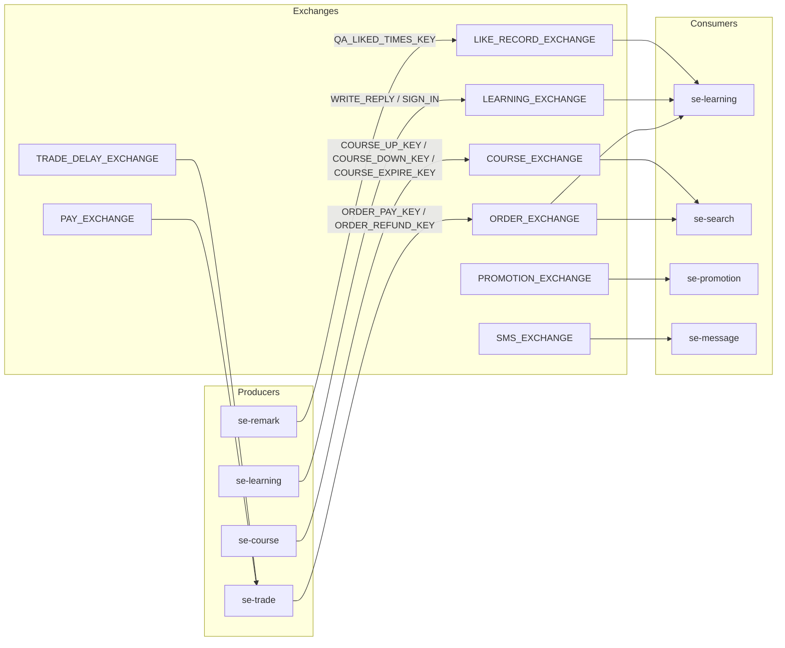

### MQ 消息处理器汇总

| Handler | 所属模块 | 监听Exchange | 处理逻辑 |
|---------|---------|-------------|---------|
| LessonChangeListener | se-learning | ORDER_EXCHANGE | 支付→加课表, 退款→删课表 |
| LikedRecordListener | se-learning | LIKE_RECORD_EXCHANGE | 批量更新点赞数 |
| LearningPointsListener | se-learning | LEARNING_EXCHANGE | 回答+5分, 签到+分 |
| CourseEventListener | se-search | COURSE_EXCHANGE | 上架→加索引, 下架→删索引 |
| OrderEventListener | se-search | ORDER_EXCHANGE | 支付→销量+1, 退款→销量-1 |
| PayMessageHandler | se-trade | PAY_EXCHANGE + DELAY | 支付成功→更新订单, 退款结果→更新退款 |
| PromotionMqHandler | se-promotion | PROMOTION_EXCHANGE | 领券→校验+创建记录 |
| SmsMessageHandler | se-message | SMS_EXCHANGE | 接收短信请求→发送 |
| RefundJobHandler | se-trade | XXL-Job定时 | 分页查询待退款→发送退款请求 |
| NoticeJobHandler | se-message | XXL-Job定时 | 分页查询待发通知→执行通知 |

---

## 16. 核心业务流程图

### 16.1 完整购买流程

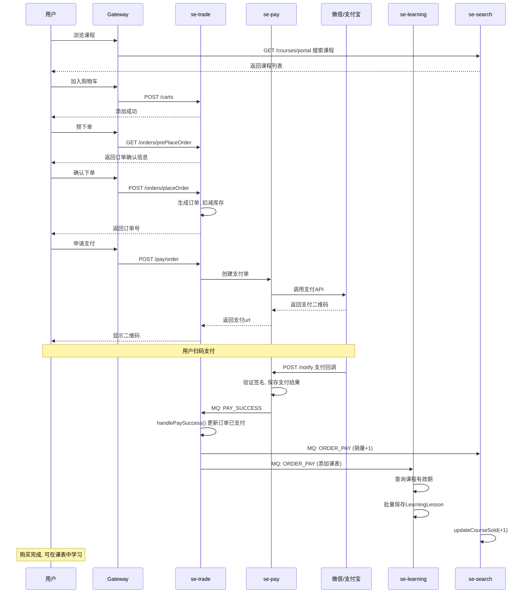

### 16.2 退款流程

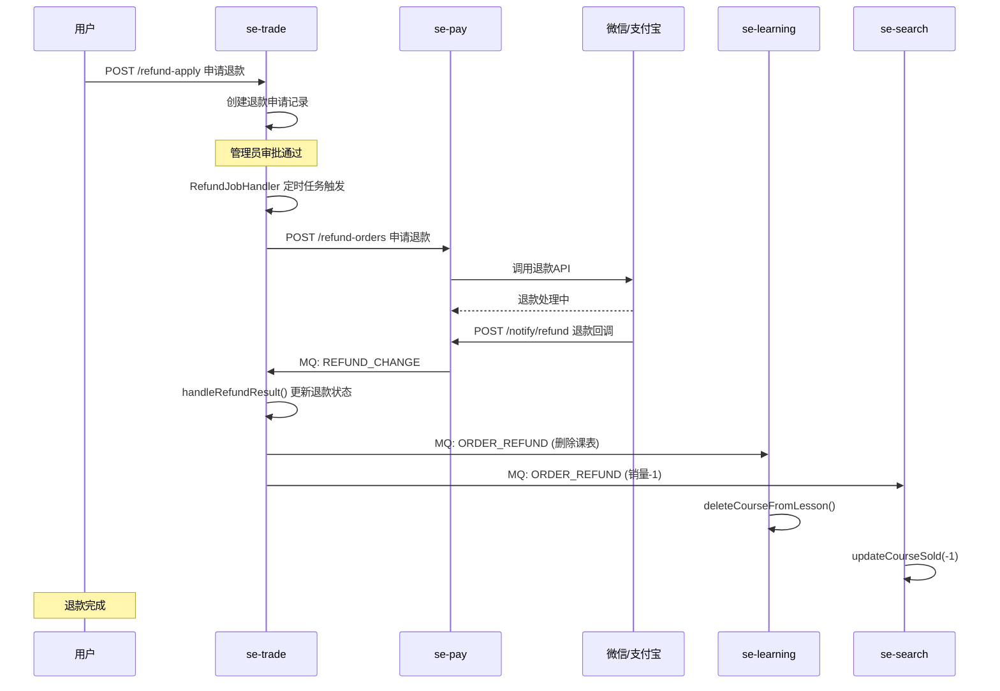

### 16.3 学习流程

```mermaid
flowchart TD
    A([开始学习]) --> B[GET /lessons/page 查看课表]
    B --> C[选择课程]
    C --> D[GET /lessons/{courseId}/valid 校验权限]
    D --> E{是否有权限?}
    E -->|否| F[提示: 未购买或已过期]
    E -->|是| G[开始学习视频/图文]
    G --> H[POST /learning-records 提交学习记录]
    H --> I[更新学习进度]
    I --> J{是否完成?}
    J -->|否| G
    J -->|是| K[标记课程已完成]
    K --> L[POST /sign-records 签到加分]
    L --> M([学习完成])
```

---

> 文档结束。共覆盖 **13 个微服务模块**、**135+ 个 API 端点**、**10 个消息处理器**、**6 个核心业务流程图**。
