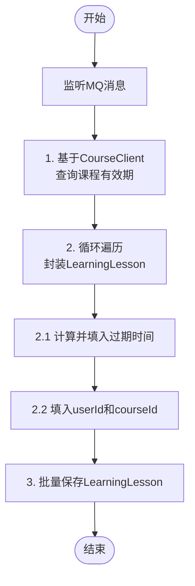

# 添加课程到课表 - 业务流程

## 需求
用户购买课程后，交易服务会通过MQ通知学习服务，学习服务将课程加入用户课表中

## 流程图



## 入参

| 参数名 | 类型 | 说明 |
|--------|------|------|
| orderId | Long | 订单id |
| userId | Long | 用户id |
| courseIds | List\<Long\> | 订单包含的课程id |
| finishTime | LocalDateTime | 支付完成时间 |

## 代码映射

```
MQ消息监听 → LessonChangeListener.onOrderMessage()
查询课程有效期 → CourseClient.getCoursesInfo()
封装LearningLesson → 循环courseIds, 设置过期时间, userId
批量保存 → learningLessonMapper.insertBatch()
```
